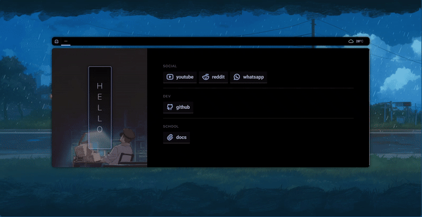

#  Cozy startpage

A simple (and editable) dark startpage/newpage:
- Colour Scheme(s): Catpuccin, Colours derived from cover image
- has multipage capability
- editable keyboard shortcuts ( s for search and q to edit config file )

## How to use
- install a custom new tab extension ( [this](https://chromewebstore.google.com/detail/custom-new-tab-url/mmjbdbjnoablegbkcklggeknkfcjkjia) is the one i use )
- edit the extension to use a local file or provide a website url hosted someplace

### Preview:

### Credits:
> this project is forked from [Axenide](https://github.com/Axenide).

> **NOTE**: keep in mind that I don't own any rights to the images included in this repository.
